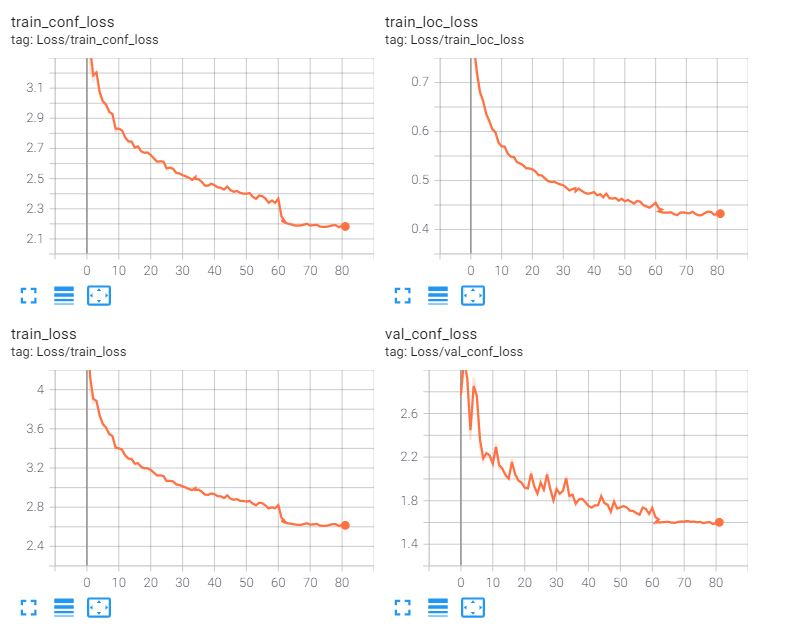
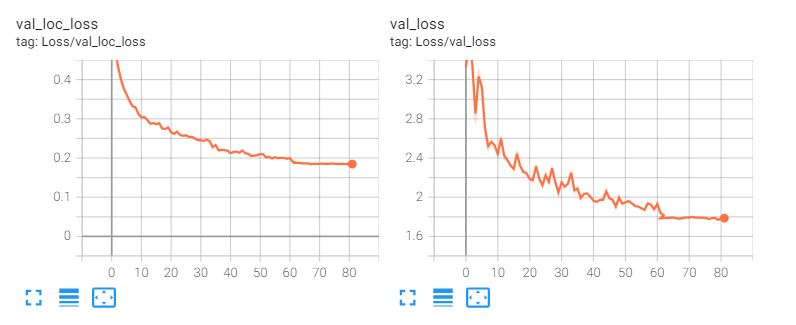
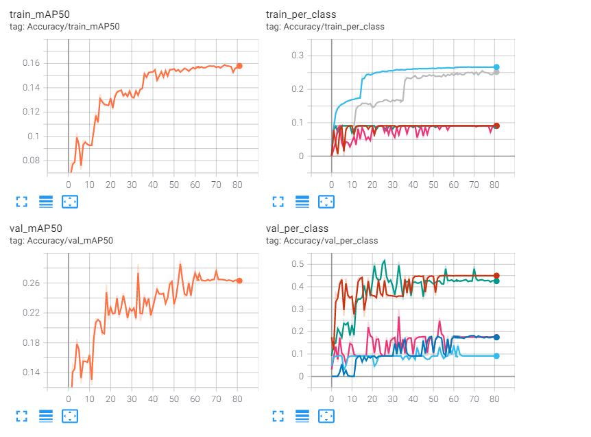

# SSD-pytorch
Single Shot MultiBox Object Detection implementation for practise.

## Dataset
Due to the fact that the model was made from scratch and in google colab, I could not use pre-trained weights or train myself on VOC or COCO. So I decided to train the model on a dataset [Udacity Self Driving Car Dataset](https://public.roboflow.com/object-detection/self-driving-car) with COCO format annotations. Before that, I, firstly, splited the dataset into test and training:
```
python ssd/datasets/splitdataset.py --dataset_root ./data --new_dataset_root ./split_dataset --ann_path ./data/_annotations.coco.json
```
And combined different types of traffic lights (trafficLight, trafficLight-Green, trafficLight-GreenLeft, trafficLight-Red and etc.) into one superclass trafficLights, nevertheless the imbalance of the classes is still significant.

To train run:
```
python train.py
```
I trained on 16 batch size during ~80 epochs. Tensorboard logs:

<p align="justify">
  
  
  
</p>
